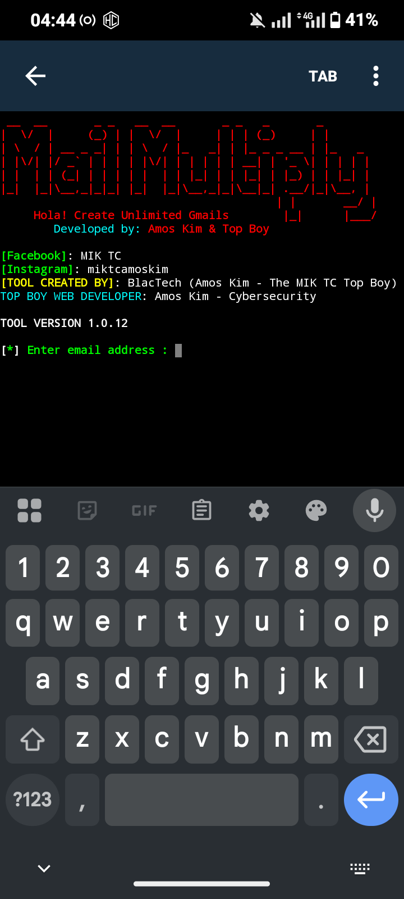
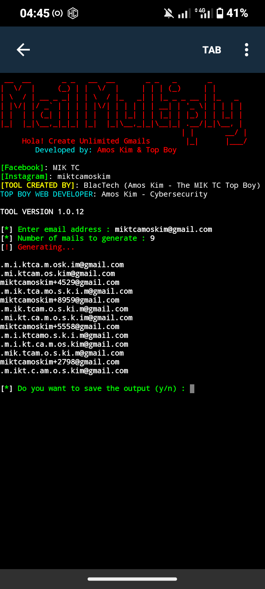

# 📧 Unlimited Gmail Alias Generator  

A powerful Python tool to generate **unlimited Gmail aliases** from a single email.  
Developed by **Amos Kim** & **Top Boy** ✨  

---

## 🎨 Preview

### Banner

### Demo Output

---

## 🚀 Features
- 🎨 Colorful ASCII banner (custom branding)  
- ✅ Validates email addresses with **regex**  
- 🔀 Generates Gmail **dot aliases** (`e.xample@gmail.com`)  
- ➕ Adds Gmail’s **“+alias” trick** (`example+1234@gmail.com`)  
- 🎲 Randomized output for uniqueness  
- 💾 Option to **save results** in a `.lst` file  

...
